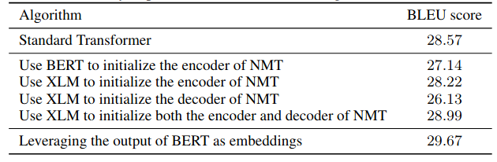
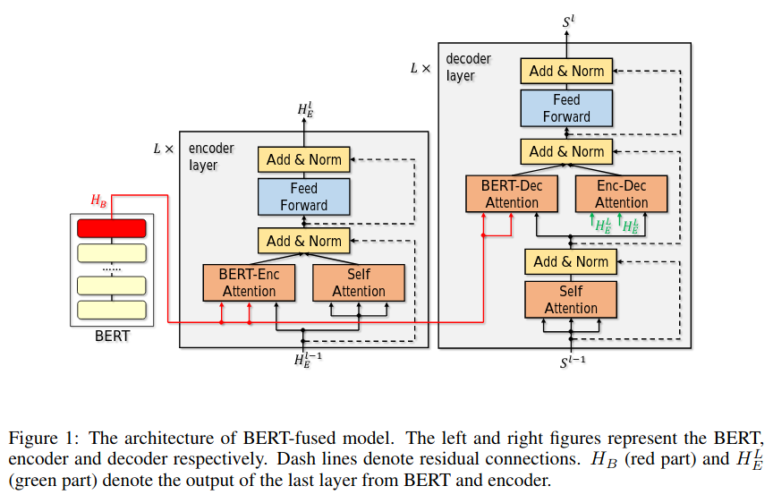
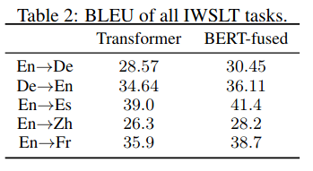
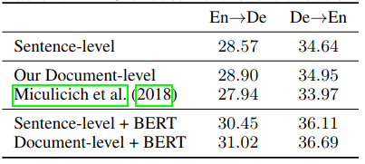
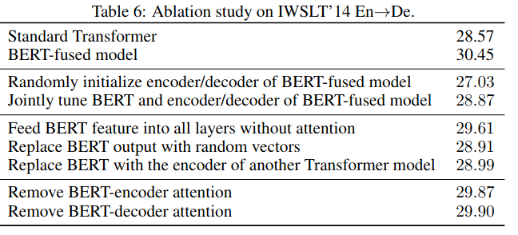

## Incorporating BERT into Neural Machine Translation

### What

1. A study of different ways of using pre-trained BERT in NMT.
2. A new method of leveraging BERT in NMT called _BERT-fused model_.

### How

1. Explore existing pre-training methods for NMT:
   
2. BERT-fused model: each layer in encoder and decoder attends to the BERT outputs.
   
3. Drop-net trick: with some probability, use only the BERT-encoder attention, only self-attention, or both.

### Results

1. Using the output of BERT as context-aware embeddings is better than fine-tuning BERT/XLM.
2. BERT-fused model is even better at the cost of increasing number of parameters and inference time (roughly at 45%):
   
3. They leverage BERT's _next sentence prediction_ task to improve document-level translation. Specifically, they concatenate two sentences with `[SEP]` as a delimiter. Results are encouraging:
   
4. Ablation study:
   