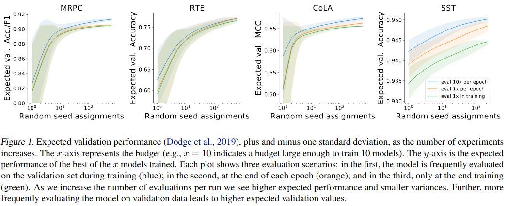
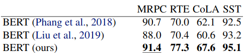

# [Fine-Tuning Pretrained Language Models: Weight Initializations, Data Orders, and Early Stopping](https://arxiv.org/pdf/2002.06305v1)

## What

Massive study of how the random seed affects fine-tuning BERT.

## How

* Run many fine-tuning sessions of BERT.
  * Try all combinations of weight initialization and data order.
  * Keep other hyperparameters fixed.
  * Do it for four tasks: paraphrase detection, textual entailment, linguistic acceptability, and sentiment analysis.
  * Fine-tune all BERT parameters, re-initialize the final layer only (2048 parameters)
* Find the impact of random seed:
  * Compute the expected validation performance as a function of computational budget (i.e., number of training sessions)
    * More runs lead to better performance
    * Even after hundreds of runs, validation performance continues to improve:
      
    * In the following table only the random seed was varied:
      
* Compare the impact of weights initialization and data order.
  * Compute the standard deviation of multiple model training runs with one of the parameters fixed.
  * Both parameters have similar impact.
  * Some weight initializations are consistently better across the tasks.
* Analyze effects of early stopping of failed experiments
  * The idea is to stop least promising trials after a fraction of training.
  * In their setup, discarding a half of runs after 20-30% of training yielded good results.
  * It's not clear how to select when and how many runs to discard in the general case.

## Results

* Running multiple trials with different random seeds can lead to substantial gains in performance.
* Weight initialization and the order of training data are equal sources of variance.
* Early stopping can save computation by eliminating unlucky runs.
* Frequent evaluation is better than evaluating after each epoch.
* All experimental data (2,100 fine-tuning trials!) is released.
