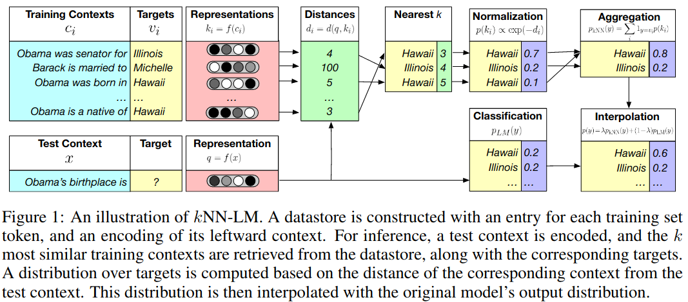

# [Generalization through Memorization: Nearest Neighbor Language Models](https://arxiv.org/pdf/1911.00172.pdf)

## What

* A method to extend a pre-trained language model by interpolating it with an external dataset.
* Can be used for:
  * domain adaptation.
  * as an alternative to training on large-scale data.
  * improving language models predictions on rare data, such as factual knowledge.

## How

1. Take a pre-trained language model. It will not change.
2. Build a "datastore":
   1. Run a forward pass on some dataset.
      - This can be an out-of-domain dataset used for adaption, or just a training set.
   2. Save the model's representation for each token (i.e., the output of the pre-softmax layer)
   3. Index the representations for fast nearest neighbor retrieval. This paper uses [FAISS](https://github.com/facebookresearch/faiss)
3. Test time:
   1. Compute a pre-trained LM's output (distribution over vocabulary) and a context representation (pre-softmax layer's output)
   2. Find *k* nearest neighbors of the context representation in the datastore.
      - FAISS makes this search really fast.
   3. From the k-nearest neighbors, compute a distribution of possible targets according to the distance.
      - Specifically, take a softmax of negative squared L2 distances.
   4. Interpolate the pre-trained LM's output with the nearest neighbor distribution.
      - The parameter λ controls how much attention to pay to each of the two models
      - λ is tuned on a validation set.

## Results

* New state-of-the-art on Wikitext-103.
* Retrieving nearest neighbors from the corpus outperforms training on it!
  * A model pre-trained on just 100M tokens and augmented with 1.6B tokens is better than a model trained on 3B tokens.
* This method can be used for domain adaption by adding an in-domain datastore.
* Code is [released](https://github.com/urvashik/knnlm).

## Analysis

* Works better than interpolation with n-gram models.
* Works better than interpolation with a training set memorized in a heavily overfitted Transformer LM.
* Most helpful in rare patterns: actual knowledge, names, and near-duplicate sentences from the training set.

