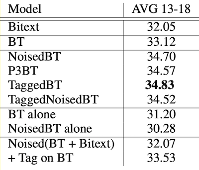

## [Tagged Back-Translation](https://arxiv.org/pdf/1906.06442.pdf)

### What

A back-translation technique that outperforms Noising BT (which was the best way of leveraging monolingual data in 2018)

### How

* Just prepend a special `<BT>` token to sentences coming from back-translation (TaggedBT).
* Alternatively, combine tagging with noising (TaggedNoisedBT).
* Noising is 10% word dropout, 10% word blanking, and a 3-constrained permutation (a permutation such that no token moves further than 3 tokens from its original position).

### Results

* TaggedBT consistently outperforms other BT schemes in low-, mid-, high-resource tasks and in iterative BT).
* The authors conclude that "noising in the context of back-translation acts merely as an indicator to the model that the source is back-translated, allowing the model to treat it as a different domain and separate the helpful signal from the harmful signal"
* Results on NewsTest EnDe:
   
